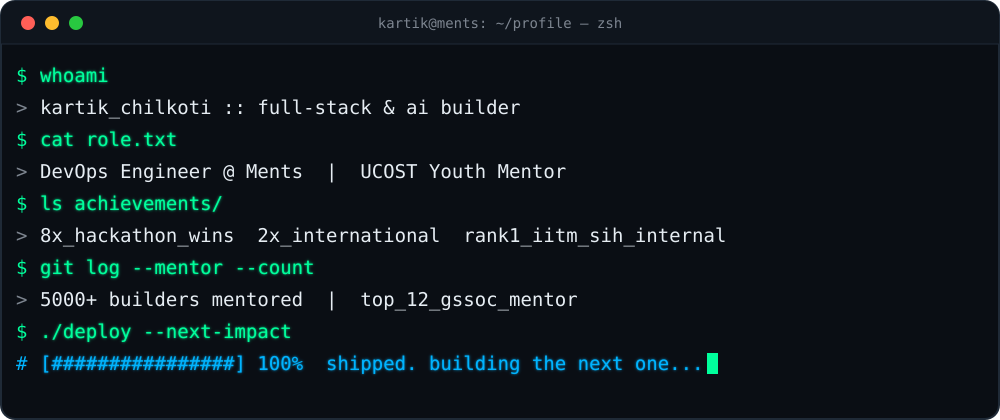
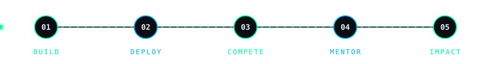

<div align="center">



<a href="https://github.com/chilkotikartik"></a>


<br/><br/>

<a href="https://www.linkedin.com/in/kartik-chilkoti/"></a>
<a href="https://www.linkedin.com/in/kartik-chilkoti/"></a>
<a href="https://dev.to/kartik_chilkoti_8cbb5980d"></a>
<a href="https://github.com/chilkotikartik?tab=repositories"></a>

<br/>


<a href="https://github.com/chilkotikartik?tab=followers"></a>
<a href="https://github.com/chilkotikartik?tab=repositories"></a>

<br/><br/>



</div>


## `$ whoami`

<table>
<tr>
<td width="52%" valign="top">

I build technology, compete at the highest level, and help other builders grow.

I'm a **Full-Stack & AI Developer** and **DevOps Engineer at Ments**, taking ideas all the way from *problem → architecture → deployment → pitch → impact*.

- 🏆 **8× hackathon winner**, **2× international** hackathon competitor
- 🥇 **#1** in IIT Madras' internal **Smart India Hackathon** round
- 🧑‍🏫 **5,000+ builders mentored** · **Top 12 GSSoC Mentor**
- 🏛️ **Youth Mentor** — Uttarakhand State Council for Science & Technology
- 🇮🇳 Presented **Sankalp AI** at **Rashtrapati Niketan**, Dehradun

</td>
<td width="48%" valign="top">



</td>
</tr>
</table>

```bash
$ cat ~/.config/kartik.env

ROLE="Full-Stack & AI Developer · DevOps Engineer @ Ments · Technical Mentor"
EXP="2+ years hands-on — software, DevOps, hackathons, open source, mentoring"
DOMAIN="AI · DevOps & Cloud · Full-Stack · Cybersecurity · EdTech · Tech for Impact"
STACK="Python · TypeScript · React/Next.js · Node/NestJS · Flask/Django · MongoDB · AWS/GCP"
OPEN_TO="SWE Intern · SDE · Full-Stack · AI Engineer · DevOps/Cloud · Backend · DevRel"
```

<div align="center"></div>


## `$ ls ~/arsenal --by-layer`

<div align="center">

<table>
<tr><td align="center" width="170"><b><code>LANGUAGES</code></b></td><td align="center"></td></tr>
<tr><td align="center"><b><code>FRONTEND</code></b></td><td align="center"></td></tr>
<tr><td align="center"><b><code>BACKEND</code></b></td><td align="center"></td></tr>
<tr><td align="center"><b><code>DATA &amp; CLOUD</code></b></td><td align="center"></td></tr>
<tr><td align="center"><b><code>DEVOPS &amp; TOOLS</code></b></td><td align="center"></td></tr>
</table>


</div>


## `$ ./skill_matrix --scan`

<table>
<tr>
<td width="44%" valign="middle"></td>
<td width="56%" valign="middle">

| Domain | Level | Signal |
|:--|:--|:--|
| 🚀 **DevOps & Cloud** | `▰▰▰▰▰▰▰▰▱▱` | CI/CD, deployment workflows, AWS & GCP ops at Ments and SIH |
| 🌐 **Full-Stack** | `▰▰▰▰▰▰▰▰▱▱` | React · Next.js · Node · NestJS · Flask · Django · Socket.IO |
| 🤖 **AI / Data** | `▰▰▰▰▰▰▰▰▱▱` | GenAI, prompt engineering, AI APIs, PyTorch |
| 🗄️ **Databases** | `▰▰▰▰▰▰▰▱▱▱` | MongoDB · PostgreSQL · MySQL · Firebase · Advanced SQL |
| 🔐 **Security** | `▰▰▰▰▰▰▰▱▱▱` | Ethical hacking, secure coding, SecOps, AppSec |
| 🧑‍🏫 **Mentorship** | `▰▰▰▰▰▰▰▰▰▰` | 5,000+ mentored · UCOST Youth Mentor · Top 12 GSSoC |

</td>
</tr>
</table>


## `$ ls ~/projects --featured`

<div align="center">




</div>

<details open>
<summary><b>🚆 MetroMind AI</b> — AI-driven train induction planning & scheduling · <i>Smart India Hackathon 2025</i></summary>
<br/>

| Stack | Scale | Impact |
|:--|:--|:--|
| AI · Data Science · Dashboard · Backend · DevOps | Kochi Metro Rail Limited (KMRL) problem statement | **#1** in IIT Madras internal SIH round · one of **45 teams** representing IIT Madras at SIH 2025 |

- **Role — DevOps Engineer:** owned deployment & infrastructure workflows for the team's AI solution
- Supported the engineering environment across ML, data, backend and dashboard teammates
- Drove end-to-end technical delivery from build to final demo

<a href="https://github.com/Perceptron04/KMRL_SIH"></a>

</details>

<details>
<summary><b>🇮🇳 Sankalp AI</b> — AI innovation for real-world social impact · <i>National Technology Day 2026</i></summary>
<br/>

| Stack | Scale | Impact |
|:--|:--|:--|
| AI · ML · Software Development | National-level showcase | Presented at **Rashtrapati Niketan, Dehradun** to researchers incl. ISRO and CSIR-IIP professionals |

- **Role — Co-developer:** technical implementation, innovation direction and presentation

<a href="https://github.com/chilkotiKartik/sankalp-ai"></a>

</details>

<details>
<summary><b>🤝 Collab-Sphere X</b> — AI-powered open-source collaboration platform</summary>
<br/>

| Stack | Scale | Impact |
|:--|:--|:--|
| Full Stack · AI | Built for open-source developer communities | AI-assisted collaboration for contributors and maintainers |

- **Role:** product development, technical implementation and AI integration

</details>

<details>
<summary><b>🔥 IgniteHub X</b> — Human-AI ecosystem for student builders</summary>
<br/>

| Stack | Scale | Impact |
|:--|:--|:--|
| AI · Full Stack · Community | Designed for student builders | Learning, collaboration, open source and project incubation in one hub |

- **Role:** platform ideation, product direction and core technical development

</details>

<details>
<summary><b>🌱 Tech X</b> — Technology for biodiversity & sustainability</summary>
<br/>

| Stack | Scale | Impact |
|:--|:--|:--|
| Web · AI · Eco-Tech | Sustainability initiative | Applies web and AI to technology-for-good problems |

- **Role:** development and experimentation around eco-tech and social impact

</details>


## `$ git log --career --graph`

```diff
@@ 2026 → PRESENT @@  DevOps Engineer · Ments
```
- Engineer on the technology team of **Ments** — a platform connecting projects, startups, talent, mentorship, hiring and funding
- Build reliable, scalable deployment and infrastructure workflows for the platform
- Drive DevOps automation and cloud operations
- Work across a startup ecosystem with **IIT Madras** and **BITS Pilani Hyderabad** collaborations

`DevOps` `CI/CD` `Cloud` `Scalable Deployment` `Startups`

```diff
@@ 2026 → PRESENT @@  Youth Mentor · Uttarakhand State Council for Science & Technology
```
- Featured mentor in a **Government of Uttarakhand** mentorship initiative
- Guide students in Engineering, Web Development, IoT, Leadership and Research & Innovation
- Provide technical and career direction to learners across Uttarakhand through digital mentorship
- Help grow a state-level ecosystem for young innovators

`Mentorship` `Web Dev` `IoT` `Leadership`

```diff
@@ 2026 → PRESENT @@  Technology & Community Contributor · Colab Nation
```
- Contribute to student-focused technology and community initiatives
- Work on AI education, prompt engineering and builder culture
- Help organize learning and technology challenges
- Drive community-led innovation and student engagement

`AI Education` `Prompt Engineering` `Community`

```diff
@@ 2026 @@  Mentor · Elite Coders Winter of Code  ·  Hackathon Mentor · Elite Hack 1.0
```
- Mentored **5,000+ developers** through Elite Coders Winter of Code
- Guided open-source contributors to raise skill and contribution quality
- Mentored hackathon teams on ideation, technical approach and execution
- Gave practical feedback on product development and hackathon strategy

`Open Source` `Mentorship` `Hackathons`

```diff
@@ 2025 @@  DevOps Engineer · Team MetroMind AI — Smart India Hackathon
```
- DevOps Engineer on an AI-driven train induction & scheduling system for **Kochi Metro Rail Limited**
- Ran infrastructure, deployment and engineering workflows for the team's solution
- Collaborated across ML, data, backend, dashboard and operations roles
- Team ranked **#1** in the IIT Madras internal SIH round — one of **45 teams** to represent IIT Madras

`DevOps` `AI/ML` `Deployment` `Smart Mobility`


## `$ cat trophies.log`

<div align="center">



<br/>

| 🏆 Achievement | 📌 Details |
|:--|:--|
| **8× Hackathon Winner** | Wins across national and student hackathons |
| **2× International Hackathons** | Including **Top 4** at the Indo-Israel International Hackathon |
| **#1 — IIT Madras SIH Internal Round** | Team MetroMind AI · one of 45 teams representing IIT Madras at SIH 2025 |
| **Top 12 GSSoC Mentor** | GirlScript Summer of Code |
| **5,000+ Builders Mentored** | Elite Coders Winter of Code & mentorship platforms |
| **Youth Mentor — UCOST** | Uttarakhand State Council for Science & Technology |
| **Hackathon Mentor** | Hackathon under BITS Pilani Hyderabad · Elite Hack 1.0 · Unstop Student Mentor |
| **National Technology Day 2026** | Presented Sankalp AI at Rashtrapati Niketan, Dehradun |
| **5★ HackerRank** | Python & Problem Solving |
| **2026 Global Recognition Award** | Innovation, Leadership, Research & Social Impact |

</div>

<details>
<summary><b>📜 Certifications & credentials</b></summary>
<br/>

| Credential | Issuer |
|:--|:--|
| Certified Ethical Hacker (CEH) | — |
| SQL (Advanced) | HackerRank |
| Software Engineer Intern | HackerRank |
| AWS SysOps Associate 2022: Key & Certificate Management | — |
| SecOps Engineer: Secure Coding | — |
| Introduction to MATLAB & Simulink | NIELIT |
| Programming Robo Pro Coding | Infosys |
| NEC '24 Track | E-Cell, IIT Bombay |
| Social Winter of Code | — |
| Google Cloud Skill Badges | Google Cloud |
| HackIndia | HackIndia |

</details>


## `$ ls ~/arenas`

<div align="center">


<a href="https://www.geeksforgeeks.org/user/chilkotiofbf/"></a>
<a href="https://hackindia.org/profile/chilkotikartik"></a>

</div>


## `$ gh telemetry --live`

<div align="center">


</div>


## `$ ./snake --eat contributions`

<div align="center">
<picture>
  <source media="(prefers-color-scheme: dark)" srcset="https://raw.githubusercontent.com/chilkotiKartik/chilkotikartik/output/github-contribution-grid-snake-dark.svg"/>
  <source media="(prefers-color-scheme: light)" srcset="https://raw.githubusercontent.com/chilkotiKartik/chilkotikartik/output/github-contribution-grid-snake.svg"/>
  
</picture>
</div>


## `$ cat current_focus.yml`

```yaml
kartik_chilkoti:
  building:
    - Ments technology ecosystem        # DevOps Engineer
    - AI-powered products               # Collab-Sphere X · IgniteHub X
    - Full-stack apps & hackathon builds
    - Open-source & developer communities
  learning:
    - Advanced DevOps · CI/CD · cloud-native infrastructure
    - System design & scalable architecture
    - Next.js · Tailwind CSS · Socket.IO · MongoDB · Three.js
    - AI integration
  exploring:
    - GenAI for learning                # IgniteHub X
    - Tech for sustainability           # Tech X
    - Smart mobility                    # MetroMind AI
  mentoring:
    - UCOST Youth Mentorship
    - Open-source contributors & hackathon teams
  open_to:
    - Software Engineer Intern / SDE
    - Full-Stack · Backend Developer
    - AI Engineer · AI Application Engineer
    - DevOps · Cloud Engineer
    - Developer Relations · Open Source Programs · R&D
```


## `$ ssh kartik@connect`

<div align="center">

<a href="https://www.linkedin.com/in/kartik-chilkoti/"></a>
<a href="https://github.com/chilkotikartik"></a>
<a href="https://dev.to/kartik_chilkoti_8cbb5980d"></a>
<a href="https://hackindia.org/profile/chilkotikartik"></a>
<a href="https://www.geeksforgeeks.org/user/chilkotiofbf/"></a>

<br/><br/>

<b><code>"I build technology, compete at the highest level, and help other builders grow."</code></b>


</div>
